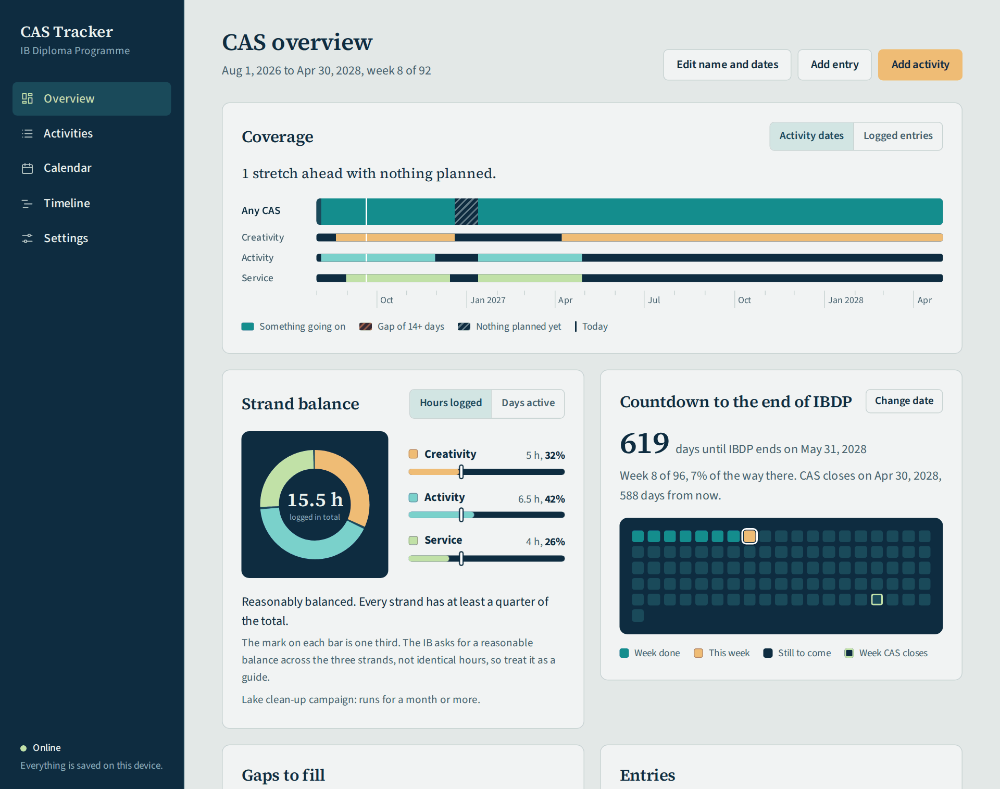

# CAS Tracker

A small web app for keeping track of CAS (Creativity, Activity, Service) across the two years of the
IB Diploma Programme. It runs in the browser, works with no internet connection, and keeps everything
on your own device.

**Open it here:** https://haywoodkawai.github.io/CAS-IBDP-Tracker/

## Why it exists

CAS is meant to be continuous. The usual problem is not a lack of activities but quiet stretches where
nothing is happening, which only get noticed when it is too late to fix them. This tracker puts the whole
programme on one timeline and marks every stretch with nothing going on, so gaps can be filled while
there is still time.

## What it does

- **Activities** with strands, start and end dates, supervisor, goals, the seven learning outcomes and a
  CAS project flag.
- **Entries** inside each activity: sessions, milestones, reflections and planning steps, with optional
  hours, notes, an evidence link and up to six photos.
- **Supervisor feedback** as its own kind of record: what the supervisor said, what the student thinks
  about it, and what they will do next.
- **A timeline for every activity**, showing its entries in order and pointing out long stretches with
  nothing logged.
- **Calendar**: pick any day to log an entry or start an activity. Days that fall inside a gap are hatched.
- **Programme timeline**: one bar per activity across the full CAS period, with gaps shown as hatched bands.
- **Coverage check**, either by activity dates or, more strictly, by whether anything was actually
  logged that week. The gap length that triggers a warning is adjustable (14 days by default).
- **Strand balance**: a ring chart of how Creativity, Activity and Service compare, by hours logged or by
  days active, with a marker at the one-third point.
- **Countdown to the end of IBDP**, drawn as one square per week.
- **Learning outcomes** at a glance, including any that no activity covers yet.
- **Backup and restore** to a single file, a spreadsheet (CSV) export of all entries, and a print view.
- Light and dark mode.

## Using it

1. Open the link above and set your name, CAS dates and IBDP end date. All of them can be changed later
   with "Edit name and dates" or under Settings.
2. Add an activity, then log entries and supervisor feedback inside it as you go.
3. Look at the overview now and then. If a hatched band appears, that is a gap: use "Plan something here".

**Install it like an app.** In Chrome or Edge, use the install icon in the address bar. On an iPhone or
iPad, use Share, then Add to Home Screen. After the first visit it opens and saves without a connection.

## Your data and privacy

- Nothing you enter is sent anywhere. There is no account, no server and no tracking.
- Activities, feedback and photos are stored in your browser, on your device only. This repository holds
  the empty app and nothing else; everyone who opens the link starts with their own blank tracker.
- Data does not sync between devices on its own. Use **Settings > Download backup** to save one file
  (photos included), and **Settings > Restore from backup** to load it on another device.
- Clearing the browser's site data erases the record, so download a backup regularly.

## Host your own copy

There is no build step and nothing to install.

1. Download or fork this repository.
2. Upload the files to any static web host. For GitHub Pages: **Settings > Pages**, source
   "Deploy from a branch", branch `main`, folder `/ (root)`.
3. Open the address GitHub gives you.

It also runs with no hosting at all: download the files and double-click `index.html`. Installing it as
an app needs the hosted version.

If you change `index.html`, also change `VERSION` in `sw.js` (for example from `cas-tracker-v7` to
`cas-tracker-v8`) so devices that already saved the old copy fetch the new one. Saved data is not affected.

## How gaps and balance are worked out

- **Activity dates**: a day counts as covered if any activity's start-to-end range includes it. An
  activity with no end date that is not marked Completed is assumed to continue.
- **Logged entries**: a week counts only if at least one entry or piece of feedback was logged in it.
- A run of uncovered days becomes a gap once it reaches the threshold set in Settings.
- **Strand balance** uses hours logged on entries, or days (up to today) on which a strand had an activity
  running. Hours of an activity with two strands are split evenly between them.
- The IB asks for a reasonable balance across the three strands rather than identical hours, so the
  one-third markers are a guide. Check what your own CAS coordinator expects.

## What is in the repository

| File | Purpose |
| --- | --- |
| `index.html` | The whole app: layout, styles, logic and fonts in one file |
| `sw.js` | Service worker that stores the app on the device for offline use |
| `manifest.webmanifest` | Name, colours and icons used when the app is installed |
| `icon-192.png`, `icon-512.png`, `icon-maskable-512.png` | App icons |
| `screenshot.png` | The picture shown in this README |

Plain HTML, CSS and JavaScript with no frameworks or external libraries. Records are kept in
`localStorage`; photos are resized in the browser (longest side 1600 px) and kept in IndexedDB.

## Good to know

- This is an independent tool. It is not affiliated with or endorsed by the International Baccalaureate,
  and it does not replace ManageBac or whatever system your school uses for official CAS records.
- iPhone photos in HEIC format may not open in every browser. If one is refused, share it as JPG first.
- The hosted site and a double-clicked `index.html` keep separate data.

## Fonts

Source Sans 3 and Source Serif 4 by Adobe, used under the SIL Open Font License 1.1. They are embedded in
`index.html` so the typography is identical online and offline.
